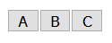
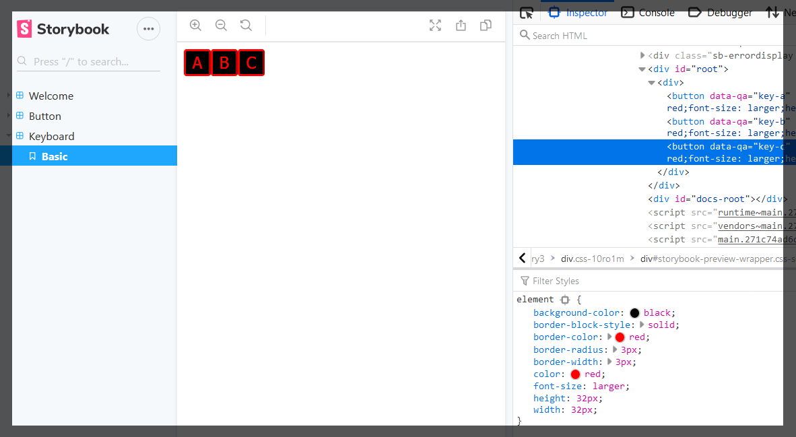
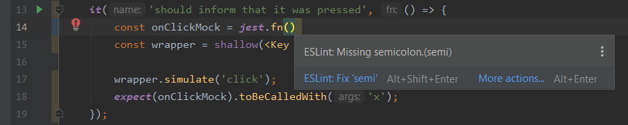
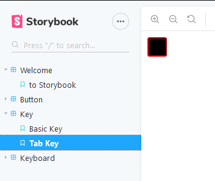
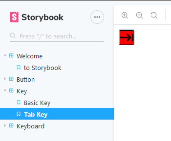
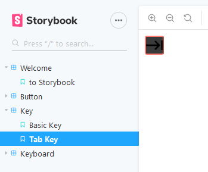
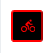
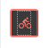

# Dumb Keyboard 4 React

A generic purpose keyboard using React to be adapted as you wish.

Let's say that I dreamt about implementing a keyboard. I achieved that goal making a fast, functional, perhaps a 
maintainable/extensible one. That's okay, the goal was having a _qwerty_ keyboard, that goal was achieved.

But then a dreamt again, dreamt about this...


The main idea is that a simple board is nothing but a set of keys and according its manufacturer it may be transformed 
into a _qwerty_ keyboard or a calculator or... Who knows?

To follow this dream, I decided to start from scratch. Like I've never implemented a keyboard in my life. I am using 
[React](https://reactjs.org/ "React") simply because I'm currently working with this technology and mostly because it is 
my favorite [Single Page Application](https://en.wikipedia.org/wiki/Single-page_application "Single Page Application") 
framework! Also, I'm using [ECMAScript 6](http://es6-features.org/ "ECMAScript 6") syntax (ES6).

Let's try to make dreams reality! 

**NOTE:** For those using [IntelliJ IDEA](https://www.jetbrains.com/idea/ "IntelliJ IDEA") or any other tool from 
JetBrains that allows working with React, I add some settings that personally I find useful for development purposes, 
just check [IntelliJ IDEA Tips](README.files/IntelliJ-IDEA-tips.md "IntelliJ IDEA Tips"). I've added notes like this 
one, specific for the subject being presented.

## Index

1. [Creating the application](#creating-the-application)
2. [TDDing](#tdding)
    1. [Failing the most basic test](#failing-the-most-basic-test)
    2. [Passing the most basic test](#passing-the-most-basic-test)
    3. [Complicating things](#complicating-things)
    4. [Adding Lodash](#adding-lodash)
    5. [Adding Voca](#adding-voca)
3. [Visualizing the Component in Real Time](#visualizing-the-component-in-real-time)
4. [Styling The Keyboard](#styling-the-keyboard)
5. [Responding to Events](#responding-to-events)
6. [Properties Validation](#properties-validation)
7. [Finding and Fixing problems using ESLint](#finding-and-fixing-problems-using-eslint)
    1. [Setting Up ESLint](#Setting-Up-ESLint "Setting Up ESLint")
    2. [Updating ESLint Configuration to match my code style](#Updating-ESLint-Configuration-to-match-my-code-style "Updating ESLint Configuration to match my code style") 
    3. [Using ESLint to automatically fix different styling](#Using-ESLint-to-automatically-fix-different-styling "Using ESLint to automatically fix different styling")
    4. [Preventing ESLint errors for global libraries](#Preventing-ESLint-errors-for-global-libraries "Preventing ESLint errors for global libraries")
    5. [Polishing my ESLint configurations](#Polishing-my-ESLint-configurations "Polishing my ESLint configurations")
8. [Visualizing our Key Component](#Visualizing-our-Key-Component "Visualizing our Key Component")
9. [Applying keys to the Keyboard](#Applying-keys-to-the-Keyboard "Applying keys to the Keyboard")
    1. [Running only one test at a time](#Running-only-one-test-at-a-time "Running only one test at a time")
    2. [Declaring a typed array property](#Declaring-a-typed-array-property "Declaring a typed array property")
    3. [Testing the integration between components](#Testing-the-integration-between-components "Testing the integration between components")
    4. [Visualizing our new keyboard](#Visualizing-our-new-keyboard "Visualizing our new keyboard")
10. [Folder restructure](#Folder-restructure "Folder restructure")
    1. [No need to import the full pathname](#No-need-to-import-the-full-pathname "No need to import the full pathname")
11. [Special Keys](#Special-Keys "Special Keys")
    1. [Differentiating a key value from what is displayed](#Differentiating-a-key-value-from-what-is-displayed "Differentiating a key value from what is displayed")
    2. [Going old school styling](#Going-old-school-styling "Going old school styling")
    3. [But some keys are different from others](#But-some-keys-are-different-from-others "But some keys are different from others")

## Creating the application

**NOTE:** For those using IntelliJ IDEA or any other tool from JetBrains that allows working with React, check 
[IntelliJ IDEA Tips](README.files/IntelliJ-IDEA-tips.md#Getting-rid-of-the-annoying-warning-"Unresolved-function-or-method-describe"-on-your-test-files "IntelliJ IDEA Tips")
to get rid of the annoying warning `Unresolved function or method describe` on your test files.

From [Creating a New React App](https://reactjs.org/docs/create-a-new-react-app.html "Creating a New React App"):
```shell script
npx create-react-app dumb-keyboard
```

## TDDing

#### Failing the most basic test
I'm using the bundled test framework that comes with React when using the `create-react-app` command, 
[Jest](https://jestjs.io/ "Jest"). It comes with the usual `describe`/`it` syntax found in other frameworks lie `mocha` 
and `jasmine`.

Creat a file under `src/components/Keyboard` named `Keyboard.test.js`.
```javascript
// file: src/components/Keyboard/Keyboard.test.js

import React from "react";
import ReactDOM from "react-dom";

describe("Keyboard", () => {
  it("should render without errors", () => {
    const container = document.createElement("div");
    document.body.appendChild(container);
    ReactDOM.render(<Keyboard />, container);
  });
});
```
Here I use plain old Javascript DOM manipulation and [ReactDOM](https://reactjs.org/docs/react-dom.html "ReactDOM") to 
render a simple component.

I'm also using [Yarn](https://yarnpkg.com/ "Yarn") as my package manager since it is the one used by React by default.

Run `yarn test`.

#### Passing the most basic test 
The test will obviously fail, let´s create the component  `Keyboard.js` under `src/components/Keyboard`. It is just to 
start our basic development.
```javascript
// file: src/components/Keyboard/Keyboard.js

import React from "react";

const Keyboard = () => <div>keyboard</div>;

export default Keyboard;
```
And change the previous test importing our new component.
```javascript
// file: src/components/Keyboard/Keyboard.test.js
.
.
.
import Keyboard from "./Keyboard";

describe("Keyboard", () => {
.
.
.
```
Run `yarn test` again. Now the most basic test of all has passed!

NOTE: In order to keep the tests running after each code modification instead of running this command every single time,
run `yarn test --watch`.

#### Complicating things
A keyboard needs a layout to hold the keys by their type. Let me start humble. The keyboard has only one key.
```
[A]
```
To ease my work, I'll work with [Enzyme](https://airbnb.io/enzyme/ "Enzyme"). From the 
[installation guide](https://airbnb.io/enzyme/docs/installation/ "Installation Guide"), I'll install the version to be 
used with React 16 (or above?).

But since we are using Yarn:
```shell script
yarn add --dev enzyme
yarn add --dev enzyme-adapter-react-16
```
Let's configure [src/setupTests.js](https://create-react-app.dev/docs/running-tests/#srcsetuptestsjs "setupTests.js") 
file to be able to test using Enzyme. Also, since we are using ES6, let's use the snippet below.
```javascript 1.8
// file: src/setupTests.js

import { configure } from 'enzyme';
import Adapter from 'enzyme-adapter-react-16';

configure({ adapter: new Adapter() });
```
Now let's add some test cases using enzyme capabilities.
```javascript 1.8
// file: src/components/Keyboard/Keyboard.test.js

. 
. 
.
import { shallow } from "enzyme";

describe("Keyboard", () => {
  .
  .
  .
  it("should find a simple key", () => {
    const wrapper = shallow(<Keyboard />);
    expect(wrapper.find('[data-qa="key-a"]').text()).toEqual("A");
  });
});
```
As expected, it will fail. Let's fix it.
```javascript 1.8
// file: src/components/Keyboard/Keyboard.js

import React from "react";

const Keyboard = () => (
  <div>
    <button data-qa="key-a">A</button>
  </div>
);

export default Keyboard;
```
That's simple and it really ain't a Keyboard, actually. Let's make it more dynamic so it can accept different keys.

Let's add a set of different keys to the keyboard. 
```javascript 1.8
// file: src/components/Keyboard/Keyboard.test.js
.
.
.
it("should accept a dynamic set of keys", () => {
  const keyboardLayout = ['A', 'B', 'C'];
  const wrapper = shallow(<Keyboard layout={keyboardLayout} />);
    
  expect(wrapper.find('[data-qa="key-a"]').text()).toEqual("A");
  expect(wrapper.find('[data-qa="key-b"]').text()).toEqual("B");
  expect(wrapper.find('[data-qa="key-c"]').text()).toEqual("C");
});
.
.
.
```
It will obviously fail on the the second expectation. There is no layout property in our keyboard and "A" button is 
still hardcoded.

#### Adding Lodash
I'll change the code so it passes the test, but before that, I'll install a nice library called 
[lodash](https://lodash.com/ "lodash").

> A modern JavaScript utility library delivering modularity, performance & extras

It adds some null/undefined automatic checking, a lot of collections utility functions, and if properly used, 
allows using Javascript in a more functional way.
```shell script
yarn add lodash
```

#### Adding Voca 
I'll also need to use string functions, and for similar reason as before, I'll install a small library for string 
manipulation that I'm very fond of, [voca](https://vocajs.com/ "voca"). According to the site:

> The Voca library offers helpful functions to make string manipulations comfortable: change case, trim, pad, slugify, 
> latinise, sprintf'y, truncate, escape and much more. The modular design allows to load the entire library, or 
> individual functions to minimize the application builds. The library is fully tested, well documented and long-term 
> supported. 
```shell script
yarn add voca
```
And now, the code!
```javascript 1.8
// file: src/components/Keyboard/Keyboard.js

import React from "react";
import { map } from 'lodash';
import { lowerCase } from "voca";

const Keyboard = ({ layout }) => (
  <div>
    {map(layout, key => {
      const uniqueKey = `key-${lowerCase(key)}`;
      return (
        <button key={uniqueKey} data-qa={uniqueKey}>{key}</button>
      );
    })}
  </div>
);

export default Keyboard;
```
Our new test passed! But the previous one failed. Of course, if no layout is passed to our component, it will never 
render a key. Let me pass a simple layout with only "A" key to make it pass again.
```javascript 1.8
// file: src/components/Keyboard/Keyboard.test.js
  .
  .
  .
  it("should find a simple key", () => {
    const keyboardLayout = ['A'];
    const wrapper = shallow(<Keyboard layout={keyboardLayout} />);

    expect(wrapper.find('[data-qa="key-a"]').text()).toEqual("A");
  });
  .
  .
  .
```
Now it is all okay! Let's check how is our Keyboard being displayed! But I do not want to be able to check it in a 
running application, it is a simple component that currently does nothing and must not be integrated. Storybooks to the 
rescue!

## Visualizing the Component in Real Time

I really like Storybook to visually check if my components are being rendered as I want. It runs a separate server
locally that allows accessing all my components in a single, organized page!

Quoting the [Storybook for React](https://storybook.js.org/docs/basics/introduction/ "Storybook for React") site:
> Storybook is a user interface development environment and playground for UI components. The tool enables developers to 
> create components independently and showcase components interactively in an isolated development environment. 

I'll use the following command since I created my application with `create-react-app`.
```
npx -p @storybook/cli sb init --type react_scripts
```
According to the documentation:
> This command adds a set of boilerplate files for Storybook in your project

A set of development dependencies and scripts will be added to your `package.json` file, also a default configuration
will be created in `.storybook/main.js` and a basic example in `src/stories`.

You can check the default Storybook site and examples with the command below.
```shell script
yarn storybook
``` 
The default Story Book can be seen by typing <http://localhost:9009> on your browser.

Now we can create a story for our component and check how it will be displayed in our application. Create a new 
file named `Keyboard.stories.js` named `src/stories`.
```javascript 1.8
import React from 'react';
import Keyboard from "../components/Keyboard/Keyboard";

export default {
  title: 'Keyboard',
  component: Keyboard,
};

export const Basic = () => <Keyboard layout={['A', 'B', 'C']} />;
``` 
It will create a story in the storybook named `Basic` under the `Keyboard` left menu. May not seem a big deal, but now 
we can decorate our keys with CSS and see how they will look like! 

Checking the Story Book, the one we have just created must be something similar to this:



## Styling The Keyboard

To help me style my keys (and everything else) I'll use a component based styling framework called 
[Styled Components](https://styled-components.com/ "Styled Components"). I've been currently using it and although there 
are plenty other options I have been enjoying this one. There are a set of 
[motivations](https://styled-components.com/docs/basics#motivation "motivations") in the website that I mostly agree 
with. 

**NOTE:** For those using IntelliJ IDEA or any other tool from JetBrains that allows working with React, check 
[IntelliJ IDEA Tips](README.files/IntelliJ-IDEA-tips.md#Styled-Components-Plugin "IntelliJ IDEA Tips") for a cool plugin 
that adds support to Styled Components.

So, let's install it! 
```shell script
yarn add styled-components
```
But how should the keyboard look like? I have what I consider a "fancy" laptop keyboard (too fancy in my opinion) that I
could mimic. Something like this:


Particularly, I'll focus on the background, text and borders. Using the browser's developer tools, I will get something 
like this:



Not the best CSS, I know, but I'm just trying to see how it would look like in real time. We can refactor it later.

Updating our keyboard using styled components would like just like that:
```javascript 1.8
// file: src/components/Keyboard/Keyboard.js

import React from "react";
import { map } from 'lodash';
import { lowerCase } from "voca";
import styled from "styled-components/macro";

const Key = styled.button`
    background-color: black;
    border-block-style: solid;
    border-color: red;
    border-radius: 3px;
    border-width: 2px;
    color: red;
    font-family: Arial;
    font-size: larger;
    height: 32px;
    margin: 2px;
    width: 32px;
`;

const Keyboard = ({ layout }) => (
  <div>
    {map(layout, key => {
      const uniqueKey = `key-${lowerCase(key)}`;
      return (
        <Key key={uniqueKey} data-qa={uniqueKey}>{key}</Key>
      );
    })}
  </div>
);

export default Keyboard;
```
Note three important things here:
1. Instead of `styled-components/macro` I could have imported just `styled-components`, but I wouldn't get more 
identifiable CSS class names prefixed by `Keyboard__Key` like `Keyboard__Key-sc-3kb479-0 jZPcQE`. They would be named 
only with something like `sc-3kb479-0 jZPcQE` making more difficult to understand which styled component is styling
that element;
2. The CSS is still there, after the desired element name, under template strings. It allows passing properties and 
applying conditionals using plain (ES6) Javascript code;
3. Instead of using React's default button component, now a new one has been created and may be used instead. I can do 
the same to my own components and also apply some sort of inheritance on them;

## Responding to Events

This is a keyboard, so I need that each key tells someone in the outer world that it was pressed. I don't want the key 
to directly change any input, label, header or whatever element that is supposed to be filled with letters on any page 
that wraps the keyboard. Keeping on with the abstraction, this virtual keyboard is like a real one. In the real world, 
most of the keyboards just send signals to the computer that interprets it and transforms it in whatever the signal must 
be transformed: render the letter "A" on a text editor, calls an application when "ENTER" is pressed on a focused 
shortcut in the desktop and so on.

So what do I expect from the keyboard right now? Nothing. I expect it from the key! Something is telling me that the key 
may be a component itself, and the keyboard is actually a composition of keys.

As TDD states, I'll start testing the key before implementing the component. But since I already know the basics of 
testing, and for the sake of not repeating these things, let me create the basic render test also to save some time.
```javascript 1.8
// src/components/Keyboard/Key.test.js

import React from "react";
import ReactDOM from "react-dom";
import Key from "./Key";
import { shallow } from "enzyme";

describe("Key", () => {
  it("should render without errors", () => {
    const container = document.createElement("div");
    document.body.appendChild(container);
    ReactDOM.render(<Key />, container);
  });

  it('should inform that it was pressed', () => {
    const onClickMock = jest.fn();
    const wrapper = shallow(<Key value="x" onClick={onClickMock} />);

    wrapper.simulate('click');
    expect(onClickMock).toBeCalledWith("x");
  });
});
```
I am using the `shallow` function from `enzyme` again. Since **Key** is a generic component now, we must inform which 
key is being rendered and somehow retrieve that it was pressed. This will be achieved by passing a function to our 
"onClick" event. This function will be called by passing the key's value as argument. Jest and enzyme allows me to 
simulate a click on the Key component and check what happened to the function passed as "click" event. 

I will assume that our new component will need a string `value` property to dynamic render the key letter and another 
function `onClick` property that must be called when the button is pressed. 

For the component, I'll grab a lot of the code that was already implemented inside the keyboard. The code to make these 
tests pass will be something similar to the one below:
```javascript 1.8
// src/components/Keyboard/Key.js

import React from "react";
import { lowerCase } from "voca";
import styled from "styled-components/macro";

const StyledButton = styled.button`
    background-color: black;
    border-block-style: solid;
    border-color: red;
    border-radius: 3px;
    border-width: 2px;
    color: red;
    font-family: Arial, serif;
    font-size: larger;
    height: 32px;
    margin: 2px;
    width: 32px;
`;

const Key = ({value, onClick}) => (
  <StyledButton data-qa={`key-${lowerCase(value)}`} onClick={() => onClick(value)}>
    {value}
  </StyledButton>
);

export default Key;
```
React's `button` component inherited from the styled component created allows using the `onClick` event. It is the 
corresponding `onclick` event from HTML's button. Both properties are being destructured as function parameters and the 
event the key being pressed is being returned using an anonymous arrow function in the `onClick` event.

**NOTE:** I am not putting too much validation o the `value` property, like it being empty string, white space or a strange
character. I may do it later.

## Properties Validation

I have created a component that needs values passed to its properties in order to be rendered correctly. As the 
application grows it will become harder and harder to manage properties checking. In that case I'll use 
[PropTypes](https://github.com/facebook/prop-types "PropTypes").

> Runtime type checking for React props and similar objects ... will check props passed to your components against those 
> definitions, and warn in development if they don’t match.
 
Before React 15.5 it was normally bundled within React. Now it is part of a separate library since it can be used with 
other frameworks now. So I'll install PropTypes.
```shell script
yarn add prop-types
```
To apply the validations I'll change `Key.js` file.
```javascript 1.8
// src/components/Keyboard/Key.js
.
.
.
import PropTypes from 'prop-types';
.
.
.
Key.propTypes = {
  value: PropTypes.string.isRequired,
  onClick: PropTypes.func,
};

Key.defaultProps = {
  onClick: () => {}
};

export default Key;
```
I added two properties validators, one being required and the other one, although it is not required, it will receive 
a default value if not passed.

Check 
[PropTypes documentation](https://reactjs.org/docs/typechecking-with-proptypes.html#proptypes "PropTypes documentation") 
for all validators types.

Current modern IDEs, some with the right plugins, may warn you about wrong component usage, styling and so on. Take 
IntelliJ's example below.



A better way to check on this validations and not relying on IDE's features would be using ESLint. Adding ESLint to my 
application and not allowing it to run unless all validations are okay is a good way to keep my code clean and that 
standards are being followed.

## Finding and Fixing problems using ESLint

[ESLint](https://eslint.org/ "ESLint") is a static checker that verifies and sometimes automatically fixes problems in 
your code based on a set of rules configured in a file. It can point me out potential risks from my code and suggest 
corrections. 

According to the website:
> ESLint is a tool for identifying and reporting on patterns found in ECMAScript/JavaScript code, with the goal of 
> making code more consistent and avoiding bugs. In many ways, it is similar to JSLint and JSHint... 

A drawback is that ESLint CLI initializer uses [npm](https://www.npmjs.com/ "npm") as its package manager. Usually I 
don't like having two package managers handling my libraries so I could install some ESLint dependencies myself using 
Yarn. I don't know if it would make any difference, that's me being suspicious. I'll try installing the dependencies 
myself and check if it works.

#### Setting Up ESLint
I'll start by setting up the default configuration file with JavaScript and React standards.

**NOTE:** Do not select to install dependencies automatically, we will install them later.
```shell script
npx eslint --init
```
I decided to answer the base questions to determine my ESLint settings. My choices are below:
```
? How would you like to use ESLint? To check syntax, find problems, and enforce code style              
? What type of modules does your project use? JavaScript modules (import/export)                        
? Which framework does your project use? React                                                          
? Does your project use TypeScript? No                                                                  
? Where does your code run? Browser                                                                     
? How would you like to define a style for your project? Use a popular style guide                      
? Which style guide do you want to follow? Standard: https://github.com/standard/standard       
? What format do you want your config file to be in? JavaScript  
? Would you like to install them now with npm? No   
```
The last question informs which packages should be installed. I'll install them manually.
```shell script
yarn add eslint --dev
yarn add eslint-config-standard --dev
yarn add eslint-plugin-standard --dev
yarn add eslint-plugin-promise --dev
yarn add eslint-plugin-import --dev
yarn add eslint-plugin-node --dev
yarn add eslint-plugin-react --dev
```
Now I'll test my new linter.
```shell script
npx eslint src/components/Keyboard/Key.test.js
```
And look at that!
```
/dumb-keyboard/src/components/Keyboard/Key.test.js                                   
   1:19  error  Strings must use singlequote  quotes
   1:26  error  Extra semicolon               semi
   2:22  error  Strings must use singlequote  quotes
   2:33  error  Extra semicolon               semi
   3:17  error  Strings must use singlequote  quotes
   3:24  error  Extra semicolon               semi
   4:25  error  Strings must use singlequote  quotes
   4:33  error  Extra semicolon               semi
   6:1   error  'describe' is not defined     no-undef
   6:10  error  Strings must use singlequote  quotes
   7:3   error  'it' is not defined           no-undef
   7:6   error  Strings must use singlequote  quotes
   8:46  error  Strings must use singlequote  quotes
   8:52  error  Extra semicolon               semi
   9:41  error  Extra semicolon               semi
  10:40  error  Extra semicolon               semi
  11:5   error  Extra semicolon               semi
  13:3   error  'it' is not defined           no-undef
  14:25  error  'jest' is not defined         no-undef
  14:34  error  Extra semicolon               semi
  15:69  error  Extra semicolon               semi
  17:30  error  Extra semicolon               semi
  18:5   error  'expect' is not defined       no-undef
  18:40  error  Strings must use singlequote  quotes
  18:44  error  Extra semicolon               semi
  19:5   error  Extra semicolon               semi
  20:3   error  Extra semicolon               semi

✖ 27 problems (27 errors, 0 warnings)
  22 errors and 0 warnings potentially fixable with the `--fix` option.
```

#### Updating ESLint Configuration to match my code style 
Seems I've been programming quite against Standard's rules! But I do like semicolons at the end. Also I like 4 spaces
indentation.

Let me update my config `.eslintrc.js` file.
```javascript 1.8
// .eslintrc.js

module.exports = {
    .
    .
    .
    "rules": {
        "semi": [2, "always"],
        "indent": ["error", 4]
    },
    .
    .
    .
};
```  

#### Using ESLint to automatically fix different styling
Now let me see what ESLint can do for me.
```shell script
npx eslint src/components/Keyboard/Key.test.js --fix
```
And _voilá_! But it still couldn't fix a lot of things:
```
/dumb-keyboard/src/components/Keyboard/Key.test.js
   6:1   error  'describe' is not defined  no-undef
   7:3   error  'it' is not defined        no-undef
  13:3   error  'it' is not defined        no-undef
  14:25  error  'jest' is not defined      no-undef
  18:5   error  'expect' is not defined    no-undef

✖ 5 problems (5 errors, 0 warnings)
```

#### Preventing ESLint errors for global libraries
This errors are related to Jest, and according React's test documentation, I shouldn't have to import them since they 
are magically injected through `src/setupTests.js` (I think). So I'll make ESLint consider it as an environment library 
updating its config file `.eslintrc.js` again.
```javascript 1.8
// .eslintrc.js

module.exports = {
    "env": {
        .
        .
        .
        "jest": true
    },
    .
    .
    .
};
```
When I run the linter again (`npx eslint src/components/Keyboard/Key.test.js`), almost all errors had vanished. 

#### Polishing my ESLint configurations
Still, a message similar to the one below may show up in the terminal, it showed up to me.
```
Warning: React version not specified in eslint-plugin-react settings. 
See https://github.com/yannickcr/eslint-plugin-react#configuration .
```
To fix it, I've added the settings attribute to the config as explained in 
[eslint-plugin-react configuration](https://github.com/yannickcr/eslint-plugin-react#configuration "eslint-plugin-react configuration")
page.
```javascript 1.8
// .eslintrc.js

module.exports = {
    .
    .
    .
    "settings": {
        "react": {
            "version": "detect"
        }
    }
};
```  
I will run the linter for my whole project.
```shell script
npx eslint src
```
There are so many violations (some from the `create-react-app` itself!). Let me add `--fix` at the end of the previous 
command and see how it deals with all of them. 

The only one left was:
```
/dumb-keyboard/src/components/Keyboard/Keyboard.js                                  
  20:21  error  'layout' is missing in props validation  react/prop-types
```
I'll leave this one for when I get back to this file.

My last change to ESLint `.eslintrc.js` config file will be...
```javascript 1.8
// .eslintrc.js

module.exports = {
    .
    .
    .
    "rules": {
        .
        .
        .
        "react/prop-types": [2]
    },
    .
    .
    .
};
```  
According to 
[ESLint Plugin React PropTypes](https://github.com/yannickcr/eslint-plugin-react/blob/master/docs/rules/prop-types.md "ESLint Plugin React PropTypes")
documentation, it will...
> Prevent missing props validation in a React component definition

I hope so.

**NOTE:** For those using IntelliJ IDEA or any other tool from JetBrains that allows working with React, check 
[IntelliJ IDEA Tips](README.files/IntelliJ-IDEA-tips.md#eslint-autofix-execution-using-file-watchers "IntelliJ IDEA Tips") 
to configure _autolint_ using File Watchers.

After all of that, running our tests will raise the following message:
```
console.error node_modules/prop-types/checkPropTypes.js:20
Warning: Failed prop type: The prop `value` is marked as required in `Key`, but its value is `undefined`.
in Key (at Key.test.js:10)
```
It is complaining about _Key_ being declared with no "value" property properly set. To fix it just add the value 
attribute to our rendering test.
```javascript 1.8
.
.
.
ReactDOM.render(<Key value="x" />, container);
.
.
.
```

## Visualizing our Key Component

So, by now I got a new decoupled component. Let me work better on its style starting with a separate story in the 
storybook.

I'll create a `src/stories/Key.stories.js` file and make a simple story, running `yarn storybook` right after.
```javascript 1.8
// src/stories/Key.stories.js

import React from 'react';
import Key from '../components/Keyboard/Key';

export default {
    title: 'Key',
    component: Key
};

export const BasicKey = () => <Key value="X" />;
```
I've named the constant `BasicKey` because it seems it was conflicting with the one in the `Keyboard` story.

Now I'll fool around with my key a little bit. Remember that all CSS I'm adding here will be parameterized in the 
future. Perhaps I even remove the styled to use plain CSS. Let me see how it goes.
```javascript 1.8
.
.
.
const StyledButton = styled.button`
    background-color: black;
    border-block-style: solid;
    border-color: red;
    border-radius: 3px;
    border-width: 2px;
    color: red;
    font-family: Arial, serif;
    font-size: larger;
    height: 32px;
    margin: 2px;
    width: 32px;
    
    :focus {
      background: #3a3a3a;
      border-color: #ff7970;
      color: #ff7970;
    }
    
    :active {
      background: red;
      border-color: black;
      color: black;
    }
`;
.
.
.
```
Alright. Enough of fooling around. Let me go back to the keyboard.

## Applying keys to the Keyboard

The keyboard ain't using the new key component yet. I've also been thinking that I do not need to define a layout right 
now. A layout is how the keys are displayed on the board, and right now, according to our abstraction, the board can be
part of a Qwerty keyboard or a calculator machine keyboard.

The base keyboard will hold a set of keys and its layout may be defined later. And to prevent unnecessary re-rendering  
of keys I'm not going to pass a set of characters that dynamically creates the desired keys (I've did it before), I'll 
pass a set of key components already created.

First, to the test.

#### Running only one test at a time
I do not want to worry about all my tests breaking at once, I'll refactor my component by running existent tests one by 
one. I'll use the `only` method (actually, the method called `only`) from the `it` function. Also will pass an empty 
array to the newly decided to create `keys` property.
```javascript 1.8
// file: src/components/Keyboard/Keyboard.test.js
.
.
.
describe('Keyboard', () => {
    it.only('should render without errors', () => {
        .
        .
        .
        ReactDOM.render(<Keyboard keys={[]} />, container);
    });
.
.
.
});
```
Humm... No ESLint complains regarding my test, but there is still that one complain about the `layout` property not 
being declared. 

#### Declaring a typed array property
Well, it ain't going to be declared that way anyway, instead I'll declare `keys` as a mandatory one.

```javascript
// file: src/components/Keyboard/Keyboard.js
.
.
.
Keyboard.propTypes = {
    keys: PropTypes.arrayOf(PropTypes.objectOf(Key)).isRequired
};

export default Keyboard;
```
This is how powerful `PropTypes` can get. I'm telling to the world (specially to the linter) that my Keyboard must have
a property called `keys` and it is an `array`. Even better, it is an array of type `Key` and it is mandatory!

Just after doing this a lot of errors and warnings will jump out of the bushes and try to grab me, so let me fix them 
all at once.
```javascript 1.8
// file: src/components/Keyboard/Keyboard.js

import React from 'react';
import { map } from 'lodash';
import PropTypes from 'prop-types';
import Key from './Key';

const Keyboard = ({ keys }) => <div>{map(keys, key => key)}</div>;

Keyboard.propTypes = {
    keys: PropTypes.arrayOf(PropTypes.objectOf(Key)).isRequired
};

export default Keyboard;
```
My keyboard component just turned out to be simpler as I thought. But how are other tests executions? Let me put the 
`only` method on this test below:
```javascript 1.8
// file: src/components/Keyboard/Keyboard.test.js
.
.
.
describe('Keyboard', () => {
    .
    .
    .
    it.only('should find a simple key', () => { 
        .
        .
        .
    });
.
.
.
});
```
Got a `Warning: Failed prop type: The prop 'keys' is marked as required in 'Keyboard', but its value is 'undefined'` and
also a `Method “text” is meant to be run on 1 node. 0 found instead`. Totally expected! To fix it I may need to try a
new (sometimes disliked) approach.

#### Testing the integration between components
I still want to be able to check the key contained by the keyboard, but using Enzyme's `shallow` function will only
render the main component and not the ones contained by it. According to Enzyme's 
[Shallow Rendering API](https://airbnb.io/enzyme/docs/api/shallow.html "Shallow Rendering API") documentation:
> Shallow rendering is useful to constrain yourself to testing a component as a unit, and to ensure that your tests 
> aren't indirectly asserting on behavior of child components.

To render inner components, I shall use `mount`, or if you prefer, 
[Full Rendering API](https://airbnb.io/enzyme/docs/api/mount.html "Full Rendering API").
> Full DOM rendering is ideal for use cases where you have components that may interact with DOM APIs or need to test 
> components that are wrapped in higher order components.

```javascript 1.8
// src/components/Keyboard/Keyboard.test.js
.
.
.
import { mount } from 'enzyme';
import Key from './Key';

describe('Keyboard', () => {
    .
    .
    .
    it('should find a simple key', () => {
        const keys = [<Key key="dk-key-a" value="A" />];
        const wrapper = mount(<Keyboard keys={keys} />);

        expect(wrapper.find('[data-qa="key-a"]').first().text()).toEqual('A');
    });

    it('should accept a dynamic set of keys', () => {
        const keyboardKeys = [
            <Key key="dk-key-a" value="A" />,
            <Key key="dk-key-b" value="B" />,
            <Key key="dk-key-c" value="C" />
        ];
        const wrapper = mount(<Keyboard keys={keyboardKeys} />);

        expect(wrapper.find('[data-qa="key-a"]').first().text()).toEqual('A');
        expect(wrapper.find('[data-qa="key-b"]').first().text()).toEqual('B');
        expect(wrapper.find('[data-qa="key-c"]').first().text()).toEqual('C');
    });
});
```
Note that to be able to find the wrapped key component I had to use the `first()` method or face the following error 
during test run:
```
Method “text” is meant to be run on 1 node. 2 found instead.
``` 
It happens because when using styled components it renders our components inside containers using the same attributes,
therefore, `data-qa="key-a"` would be found in multiple tag elements (perhaps I'll remove styled components and use 
plain CSS to make it less third-party libraries dependant. I'll see that in the future).

Also note that I've added a `key` attribute with a unique value every time I declared a Key component. Not doing this 
would cause the following message to start popping up during the tests:
```
Warning: Each child in a list should have a unique "key" prop. 
```
That's because React expects that any list item of the same components being rendered is uniquely identified by a `key` 
attribute. Nothing to do to our keyboard's keys though, as for 
[React documentation](https://reactjs.org/docs/lists-and-keys.html#keys "React documentation"):
> Keys help React identify which items have changed, are added, or are removed. Keys should be given to the elements 
> inside the array to give the elements a stable identity.

#### Visualizing our new keyboard
How may be my keyboard visually after all these changes? Le me check, let me `yarn storybook`.

Blank screen. Didn't expect it to work anyways. Checking the inspector in my browser a see the message `Warning: Failed 
prop type: The prop 'keys' is marked as required in 'Keyboard', but its value is 'undefined'`. Well, makes sense. The
Keyboard story must be updated the same way we updated the tests.
```javascript 1.8
// src/stories/Keyboard.stories.js
.
.
.
import Key from '../components/Keyboard/Key';
.
.
.
export const BasicKeyboard = () => {
    const keyboardKeys = [
        <Key key="dk-key-a" value="A" />,
        <Key key="dk-key-b" value="B" />,
        <Key key="dk-key-c" value="C" />
    ];

    return <Keyboard keys={keyboardKeys} />;
};
```
And everything seems to be working now.

## Folder restructure

Before going on, I will do a little refactoring on the folder structures for future architectural changes. It could be
done later, but I'm just in the mood for doing it now. First I'll create a `key` folder under the `Keyboard` folder and 
move my `Key.js` and `Key.test.js` to it. After that I will rename the `Keyboard` folder all to lowercase. The result 
will be:
```
├── components                                                                                          
│   └── keyboard                                                                                        
│       ├── Keyboard.js                                                                                 
│       ├── Keyboard.test.js                                                                            
│       └── key                                                                                         
│           ├── Key.js                                                                                  
│           └── Key.test.js                                                                             
```  

#### No need to import the full pathname
After that I'll create `package.json` files inside each folder. It will be used to simplify my imports without the need
to fully address the file pathname.
```json
// src/components/keyboard/package.json

{
    "name": "keyboard",
    "main": "./Keyboard.js"
}
```
```json
// src/components/keyboard/key/package.json

{
    "name": "key",
    "main": "./Key.js"
}
```
And now I update my code.
```javascript 1.8
// src/components/keyboard/key/Key.test.js
.
.
.
import Key from '.';
.
.
.
```
```javascript 1.8
// src/components/keyboard/Keyboard.js
.
.
.
import Key from './key';
.
.
.
```
```javascript 1.8
// src/components/keyboard/Keyboard.test.js
.
.
.
import Key from './key';
import Keyboard from '.';
.
.
.
```
```javascript 1.8
// src/stories/Key.stories.js
.
.
.
import Key from '../components/keyboard/key';
.
.
.
```
```javascript 1.8
// src/stories/Keyboard.stories.js
.
.
.
import Keyboard from '../components/keyboard';
import Key from '../components/keyboard/key';
.
.
.
```
Okay, all set. Let me move on.

## Special Keys

The keys in the keyboard are currently straight forward. One letter, one value. "A" is an "A", "B" is a "B". But a real
keyboard has more than simple letters (or numbers) on it, it has keys responsible for special actions! For example, the
"Enter" key, or the "Shift" key. I call them special keys, but the truth is that they are not that special, they are 
just a set of keys that are represented as images or words in a keyboard, but they just send a signal from the 
peripheral device (the keyboard) to some processor that handles this signal, just like any other key. What does it mean?
That a key sends some value to the processor connected to it through the keyboard, that may be different from the symbol
that is displayed in the keyboard itself!

#### Differentiating a key value from what is displayed
Summarizing, a key should actually have two properties, the value to be sent, and the value to be displayed. In other 
words, I want that a key in my keyboard is able to send a different value from what is being displayed on it.

In terms of a test that means...
```javascript 1.8
// src/components/keyboard/key/Key.test.js
.
.
.
describe('Key', () => {
    .
    .
    .
    it('should display a different value from the one sent when pressed', () => {
        const onClickMock = jest.fn();
        const wrapper = shallow(<Key display="x" value="y" onClick={onClickMock} />);

        wrapper.simulate('click');
        expect(wrapper.text()).toBe('x');
        expect(onClickMock).toBeCalledWith('y');
    });
});
```
I decided to have use the `children` property from avery React component. It should be the value visually available when 
seeing the keyboard while the real key value remains defined by the `value` property.

Obviously this test will fail since I didn't handle the `children` property until now.
```javascript 1.8
.
.
.
const Key = ({ value, onClick, children }) => (
  <StyledButton data-qa={`key-${lowerCase(value)}`} onClick={() => onClick(value)}>
      {children || ''}
  </StyledButton>
);

Key.propTypes = {
    value: PropTypes.string.isRequired,
    children: PropTypes.node,
    onClick: PropTypes.func
};
.
.
.
```
So now it displays one value and returns another one when clicked! I also declared `children` as non required to don't 
force any value to be displayed. Actually, I was thinking about a space bar key, it doesn't have anything on it, just a 
large empty key. I should have a test for that too!
```javascript 1.8
// src/components/keyboard/key/Key.test.js
.
.
.
describe('Key', () => {
    .
    .
    .
    it('should not enforce anything being displayed on the key', () => {
        const wrapper = shallow(<Key value="y" />);
        expect(wrapper.text()).toBe('');
    });
});
```
Of course that some of our component integration tests have failed, the keyboard one! So let me fix them.
```javascript 1.8
// src/components/keyboard/Keyboard.test.js
.
.
.
describe('Keyboard', () => {
    .
    .
    .
    it('should find a simple key', () => {
        const keys = [<Key key="dk-key-a" value="a">A</Key>];
        const wrapper = mount(<Keyboard keys={keys} />);

        expect(wrapper.find('[data-qa="key-a"]').first().text()).toEqual('A');
    });

    it('should accept a dynamic set of keys', () => {
        const keyboardKeys = [
            <Key key="dk-key-a" value="a">A</Key>,
            <Key key="dk-key-b" value="b">B</Key>,
            <Key key="dk-key-c" value="c">C</Key>
        ];
        const wrapper = mount(<Keyboard keys={keyboardKeys} />);

        expect(wrapper.find('[data-qa="key-a"]').first().text()).toEqual('A');
        expect(wrapper.find('[data-qa="key-b"]').first().text()).toEqual('B');
        expect(wrapper.find('[data-qa="key-c"]').first().text()).toEqual('C');
    });
```
And never forget our beautiful storybook!
```javascript 1.8
// src/stories/Key.stories.js
.
.
.
export const BasicKey = () => <Key value="x">X</Key>;
```
```javascript 1.8
// src/stories/Keyboard.stories.js
.
.
.
export const BasicKeyboard = () => {
    const keyboardKeys = [
        <Key key="dk-key-a" value="a">A</Key>,
        <Key key="dk-key-b" value="b">B</Key>,
        <Key key="dk-key-c" value="c">C</Key>
    ];

    return <Keyboard keys={keyboardKeys} />;
};
```
Now that I have a key that can represent a value different from what it is displayed, it is time to be able to put 
images instead of letters or texts on my keys.

#### Going old school styling
I really like [Styled Components](https://styled-components.com/ "Styled Components"). Coming from a strong software
engineer background with little or even no design experience, navigating through the tempest seas of 
[Cascade Style Sheet](https://www.w3.org/Style/CSS/Overview.en.html "Cascade Style Sheet") (a.k.a. CSS) can be very 
disturbing.

But there is a good reason I'll stop using Styled Components (for now) in this project, I'm intending to evolve it to a 
node package possible of installing using `npm` or `yarn` and I want the least third-party dependencies as possible.

So let me clean up the code a little bit.
```javascript 1.8
// src/components/keyboard/key/Key.js

import React from 'react';
import { lowerCase } from 'voca';
import PropTypes from 'prop-types';

const Key = ({ value, onClick, children }) => (
    <button data-qa={`key-${lowerCase(value)}`} onClick={() => onClick(value)}>
        {children || ''}
    </button>
);
.
.
.
```
Checking the storybook again I see my keys falling down to ugliness. But I'll ease my heart. That's not for too long.

According to React's [Styling and CSS](https://reactjs.org/docs/faq-styling.html "Styling and CSS") page, is just a 
matter of adding a `className` attribute!

**NOTE:** Also in this page, it has some thoughts about 
[CSS-in-JS](https://reactjs.org/docs/faq-styling.html#what-is-css-in-js "CSS-in-JS") that links to Michele Bertoli's 
[CSS in JS](https://github.com/MicheleBertoli/css-in-js#css-in-js "CSS in JS") page. Guess who shows up on the list? Our
previous friend `Styled Components`.

I'll change my key component just a little bit.
```javascript 1.8
// src/components/keyboard/key/Key.js
    .
    .
    .
    <button className="dk-key" data-qa={`key-${lowerCase(value)}`} onClick={() => onClick(value)}>
        {children || ''}
    </button>
    .
    .
    .
```
What is `dk-key`? Just some CSS class for a dumb keyboard key that must be defined in order to style it. Let's talk 
storybook here!

First I will create the CSS file based on what I already had implemented before.
```css
/* src/stories/Key.css */

.dk-key {
    background-color: black;
    border-block-style: solid;
    border-color: red;
    border-radius: 3px;
    border-width: 2px;
    color: red;
    font-family: Arial, serif;
    font-size: larger;
    height: 32px;
    margin: 2px;
    width: 32px;
}

.dk-key:focus {
    background: #3a3a3a;
    border-color: #ff7970;
    color: #ff7970;
}

.dk-key:active {
    background: red;
    border-color: black;
    color: black;
}
```
And after that, import it to my story.
```javascript 1.8
// src/stories/Key.stories.js
.
.
.
import './Key.css';
.
.
.
```
For some reason I did not have to do the same to `src/stories/Keyboard.stories.js`. Perhaps Storybook sets the CSS file 
as global once used for the first time. I do not know. In case it didn't work on the Keyboard story, I would just import 
the file as I did previously.

#### But some keys are different from others
I'm now able to declare any style for my keys just setting my `dk-key` CSS class. The only thing that should be 
considered is that if I change the style, I'll change all keys at once! So I'm gonna create another CSS class 
placeholder that may overwrite the previous settings, but for a particular key.
```javascript 1.8
// src/components/keyboard/key/Key.js

import React from 'react';
import PropTypes from 'prop-types';

const Key = ({ value, onClick, children }) => {
    const keyIdentifier = `dk-key-${value ? value.toLowerCase() : 'NO-VALUE'}`;
    return (
        <button className={`dk-key ${keyIdentifier}`} data-qa={keyIdentifier} onClick={() => onClick(value)}>
            {children || ''}
        </button>
    );
};
.
.
.
```
I've changed a couple of things here:
1. I got rid of the `voca` import since I want to make my keyboard less dependant of third-party packages;
2. I've changed the `data-qa` value so it relates to my component even more. Of course some tests will break;
3. the `className` now accepts CSS class overload;

For the first point, note that now I had to make a validation in case `value` is not defined. But how could it 
happen if it is declared as `required` in the `PropTypes`? Well, I guess (but haven't confirmed yet) that Enzyme's 
`mount` function performs a set of component instantiation with no properties (can't guess why though). Without `voca` 
preventing unwanted `undefined` errors to be raised, I have to perform the validations myself.

For the second point, let me fix the tests.
```javascript 1.8
// src/components/keyboard/Keyboard.test.js
.
.
.
describe('Keyboard', () => {
    .
    .
    .
    it('should find a simple key', () => {
        const keys = [<Key key="dk-key-a" value="a">A</Key>];
        const wrapper = mount(<Keyboard keys={keys} />);

        expect(wrapper.find('[data-qa="dk-key-a"]').first().text()).toEqual('A');
    });

    it('should accept a dynamic set of keys', () => {
        const keyboardKeys = [
            <Key key="dk-key-a" value="a">A</Key>,
            <Key key="dk-key-b" value="b">B</Key>,
            <Key key="dk-key-c" value="c">C</Key>
        ];
        const wrapper = mount(<Keyboard keys={keyboardKeys} />);

        expect(wrapper.find('[data-qa="dk-key-a"]').first().text()).toEqual('A');
        expect(wrapper.find('[data-qa="dk-key-b"]').first().text()).toEqual('B');
        expect(wrapper.find('[data-qa="dk-key-c"]').first().text()).toEqual('C');
    });
});
```
The third point is a new CSS class name that allows changing the style of a single key by defining its specific CSS 
class. For example, let's take the keyboard story. It has 3 keys, they will render just like that:
```html
<div>
    <button class="dk-key dk-key-a" data-qa="dk-key-a">A</button>
    <button class="dk-key dk-key-b" data-qa="dk-key-b">B</button>
    <button class="dk-key dk-key-c" data-qa="dk-key-c">C</button>
</div>
```  
If I want to change only B's style, I could do the following:
```css
// src/stories/Key.css
.
.
.
.dk-key-b {
    border-color: lightgreen;
    color: lightgreen;
}

.dk-key-b:focus {
    background: #3a3a3a;
    border-color: white;
    color: white;
}

.dk-key-b:active {
    background: lightgreen;
    border-color: black;
    color: black;
}
```
Check the storybook now! We got a different greener key among the red ones!

There is a lot that can be done to make it more dynamic. For example I could set a new property to the key that allows 
setting CSS classes dynamically in case naming conventions are an issue or there is need for more overloading. Perhaps
later I'll do it, but now, I want some images!

#### Image Keys

I'll use CSS to set images to my keys instead of simple characters. I'll visit 
[Flaticon](https://www.flaticon.com/ "Flaticon") and grab a "tab" image in the [SVG](https://www.w3.org/TR/SVG2/ "SVG") 
format.

**NOTE:** For copyright reasons, be aware that the author of these images is 
[Google](https://www.flaticon.com/authors/google "Google").
```css
// src/stories/Key.css
.
.
.
.dk-key-tab {
    background-image: url(tab.svg);
}
```
Let me be honest, I didn't like it. 

##### Tab key with no focus

##### Tab key when clicked

##### Tab key on focus


The image is too big for the key! Let me fix it a little bit.
```css
// src/stories/Key.css
.
.
.
.dk-key-tab {
    background-repeat: no-repeat;
    background-image: url(tab.svg);
    background-size: 60%;
    background-position: center;
}
```
Ok, it looks better, but I'm still disliking it. I have only one image and three key states, "normal", "clicked", and 
"focused". I would need to have an image with different color for each state, and I do not really want to loose too much 
time editing and painting images to fit my design system style. Setting the background image seemed quite easy at the 
beginning, but I found it very limiting. Let me try another approach. 

#### Using inline SVG as a child component
Just researching a little bit I found another approach that can be much more helpful in this wonderful 
[CSS Tricks](https://css-tricks.com/change-color-of-svg-on-hover/#article-header-id-0 "CSS Tricks") page. I'll try to
use inline SVG images!

I'll grab the same bike image from this page and create a React component...
```javascript 1.8
// src/stories/Images.js

import React from 'react';

const BikeImage = () => (
    <svg width="24" height="24" viewBox="0 0 24 24">
        <path d="M5,20.5A3.5,3.5 0 0,1 1.5,17A3.5,3.5 0 0,1 5,13.5A3.5,3.5 0 0,1 8.5,17A3.5,3.5 0 0,1 5,20.5M5,12A5,5 0 0,0 0,17A5,5 0 0,0 5,22A5,5 0 0,0 10,17A5,5 0 0,0 5,12M14.8,10H19V8.2H15.8L13.86,4.93C13.57,4.43 13,4.1 12.4,4.1C11.93,4.1 11.5,4.29 11.2,4.6L7.5,8.29C7.19,8.6 7,9 7,9.5C7,10.13 7.33,10.66 7.85,10.97L11.2,13V18H13V11.5L10.75,9.85L13.07,7.5M19,20.5A3.5,3.5 0 0,1 15.5,17A3.5,3.5 0 0,1 19,13.5A3.5,3.5 0 0,1 22.5,17A3.5,3.5 0 0,1 19,20.5M19,12A5,5 0 0,0 14,17A5,5 0 0,0 19,22A5,5 0 0,0 24,17A5,5 0 0,0 19,12M16,4.8C17,4.8 17.8,4 17.8,3C17.8,2 17,1.2 16,1.2C15,1.2 14.2,2 14.2,3C14.2,4 15,4.8 16,4.8Z"></path>
    </svg>
);

export { BikeImage };
``` 
... Create another story for this "bike" key...
```javascript 1.8
// src/stories/Key.stories.js
.
.
.
import { BikeImage } from './Images';
.
.
.
export const BikeKey = () => (
    <Key value="bike">
        <BikeImage />
    </Key>
);
```
... And finally add some CSS to style it.
```css
.
.
.
.dk-key-bike svg {
    fill: red;
    width: 120%;
    height: 100%;
}

.dk-key-bike:focus svg {
    fill: #ff7970;
}

.dk-key-bike:active svg {
    fill: black;
}
```
Much more interesting.






**To Be Continued**

## Profiling

**To Be Continued**

#### Why Did it Render

**To Be Continued**

#### Chrome React Profiler

Highlight when a component render  

**To Be Continued**
