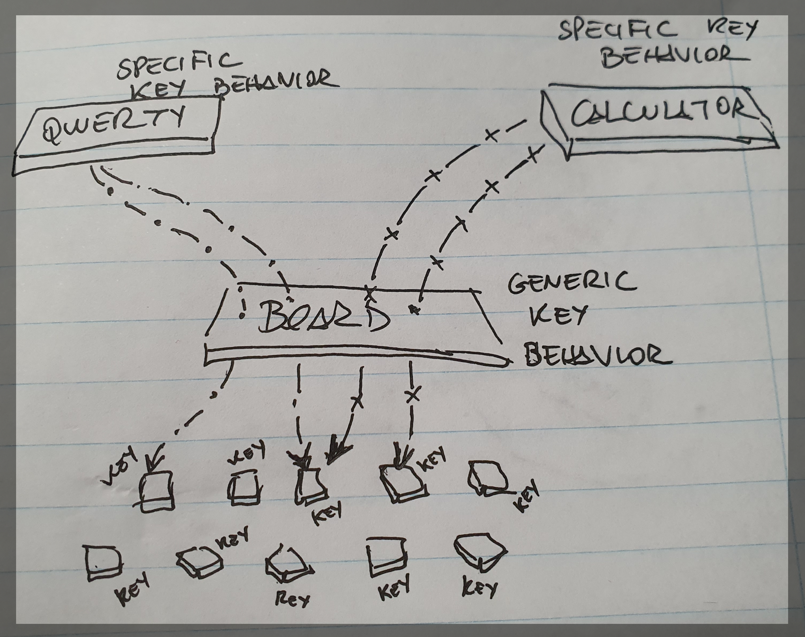

# Dumb Keyboard
A generic purpose keyboard to be adapted as you wish

Let's say that I dreamt about implementing a keyboard. I achieved that goal making a fast, functional, perhaps a 
maintainable/extensible one. That's okay, the goal was having a _qwerty_ keyboard, that goal was achieved.

But then a dreamt again, dreamt about this...



The main idea is that a simple board is nothing but a set of keys and according its manufacturer it may be transformed 
into a _qwerty_ keyboard or a calculator or... Who knows?

To follow this dream, I decided to start from scratch. Like I've never implemented a keyboard in my life.

Let's try to make dreams reality! 

## Creating the application

From [Creating a New React App](https://reactjs.org/docs/create-a-new-react-app.html "Creating a New React App"):
```
npx create-react-app dumb-keyboard
```

## TDDing

**NOTE:** For those using IntelliJ IDEA or any other tool from JetBrains that allows working with React, I add some 
settings that personally I find useful for development purposes, just check [IntelliJ IDEA Tips](README.files/IntelliJ-IDEA-tips.md "IntelliJ IDEA Tips");

#### Failing the most basic test
Creat a file under `src/components/Keyboard` named `Keyboard.test.js`.
```javascript
// file: src/components/Keyboard/Keyboard.test.js

import React from "react";
import ReactDOM from "react-dom";

describe("Keyboard", () => {
  it("should render without errors", () => {
    const container = document.createElement("div");
    document.body.appendChild(container);
    ReactDOM.render(<Keyboard />, container);
  });
});
```
Run `yarn test`.
#### Passing the most basic test 
Test will obviously fail, let´s create the component  `Keyboard.js` under `src/components/Keyboard`. It is just to start 
our basic development.
```javascript
// file: src/components/Keyboard/Keyboard.js

import React from "react";

const Keyboard = () => <div>keyboard</div>;

export default Keyboard;
```
And change the previous test.
```javascript
// file: src/components/Keyboard/Keyboard.test.js
.
.
.
import Keyboard from "./Keyboard";

describe("Keyboard", () => {
.
.
.
```
Run `yarn test`. Now the most basic test of all has passed!

#### Complicating things
A keyboard needs a layout to hold the keys by their type. Let's start humble. The keyboard has only one key.
```
[A]
```
To ease my work, I'll work with `enzyme` (https://airbnb.io/enzyme/). From the installation guide, I'll install the 
version to be used with React 16 (or above?).

Reference: https://airbnb.io/enzyme/docs/installation/

But since we are using Yarn:
```
yarn add --dev enzyme
yarn add --dev enzyme-adapter-react-16
```
Let's configure `src/setupTests.js` file to be able to test using Enzyme. Also, since we are using ES6, let's use this 
snippet below.
```javascript 1.8
// file: src/setupTests.js

import { configure } from 'enzyme';
import Adapter from 'enzyme-adapter-react-16';

configure({ adapter: new Adapter() });
```
Now let's add some test cases using enzyme capabilities.
```javascript 1.8
// file: src/components/Keyboard/Keyboard.test.js

. 
. 
.
import { shallow } from "enzyme";

describe("Keyboard", () => {
  .
  .
  .
  it("should find a simple key", () => {
    const wrapper = shallow(<Keyboard />);
    expect(wrapper.find('[data-qa="key-a"]').text()).toEqual("A");
  });
});
```
As expected, it will fail. Let's fix it.
```javascript 1.8
// file: src/components/Keyboard/Keyboard.js

import React from "react";

const Keyboard = () => (
  <div>
    <button data-qa="key-a">A</button>
  </div>
);

export default Keyboard;
```
That's simple and it really ain't a Keyboard, actually. Let's make it more dynamic so it can accept different keys.

Let's add a set of different keys to the keyboard. 
```javascript 1.8
// file: src/components/Keyboard/Keyboard.test.js
.
.
.
it("should accept a dynamic set of keys", () => {
  const keyboardLayout = ['A', 'B', 'C'];
  const wrapper = shallow(<Keyboard layout={keyboardLayout} />);
    
  expect(wrapper.find('[data-qa="key-a"]').text()).toEqual("A");
  expect(wrapper.find('[data-qa="key-b"]').text()).toEqual("B");
  expect(wrapper.find('[data-qa="key-c"]').text()).toEqual("C");
});
.
.
.
```
It will obviously fail on the the second expectation. There is no layout property in our keyboard and "A" button is 
still hardcoded.

I'll change the code so it passes the test, but before that, I'll install a nice library called 
[lodash](https://lodash.com/ "lodash") ("A modern JavaScript utility library delivering modularity, performance & 
extras"). It adds some null/undefined automatic checking, a lot of collections utility functions, and if properly used, 
allows using Javascript in a more functional way.
```
yarn add lodash
```
I'll also need to use string functions, and for similar reason as before, I'll install a small library for string 
manipulation that I'm very fond of, [voca](https://vocajs.com/ "voca"). According to the site:
> The Voca library offers helpful functions to make string manipulations comfortable: change case, trim, pad, slugify, 
> latinise, sprintf'y, truncate, escape and much more. The modular design allows to load the entire library, or 
> individual functions to minimize the application builds. The library is fully tested, well documented and long-term 
> supported. 
```
yarn add voca
```
And now, the code!
```javascript 1.8
// file: src/components/Keyboard/Keyboard.js

import React from "react";
import { map } from 'lodash';
import { lowerCase } from "voca";

const Keyboard = ({ layout }) => (
  <div>
    {map(layout, key => {
      const uniqueKey = `key-${lowerCase(key)}`;
      return (
        <button key={uniqueKey} data-qa={uniqueKey}>{key}</button>
      );
    })}
  </div>
);

export default Keyboard;
```
Our new test passed! But the previous one failed. Of course, if no layout is passed to our component, it will never 
render a key. Let me pass a simple layout with only "A" key to make it pass again.
```javascript 1.8
// file: src/components/Keyboard/Keyboard.test.js
  .
  .
  .
  it("should find a simple key", () => {
    const keyboardLayout = ['A'];
    const wrapper = shallow(<Keyboard layout={keyboardLayout} />);

    expect(wrapper.find('[data-qa="key-a"]').text()).toEqual("A");
  });
  .
  .
  .
```
Now it is all okay! Let's check how is our Keyboard being displayed! But I do not want to be able to check it in a 
running application, it is a simple component that currently does nothing and must not be integrated. Storybooks to the 
rescue!

## Storybook for React

Storybook is the best way to visually check if your components are being rendered as you want. It runs a separate server
locally that allows accessing all your components in a single, organized page!

Quoting the [Storybook for React site](https://storybook.js.org/docs/basics/introduction/ "Storybook for React"):
> Storybook is a user interface development environment and playground for UI components. The tool enables developers to 
> create components independently and showcase components interactively in an isolated development environment. 

I'll use the following command since I created my application with `create-react-app`.
```
npx -p @storybook/cli sb init --type react_scripts
```
According to the documentation:
> This command adds a set of boilerplate files for Storybook in your project

A set of development dependencies and scripts will be added to your `package.json` file, also a default configuration
will be created in `.storybook/main.js` and a basic example in `src/stories`.

You can check the default Storybook site and examples with the command below.
``` 
yarn storybook
``` 
Now we can create a storybook for our component and check how it will be displayed in our application. Create a new 
file named `Keyboard.stories.js` named `src/stories`.
```javascript 1.8
import React from 'react';
import Keyboard from "../components/Keyboard/Keyboard";

export default {
  title: 'Keyboard',
  component: Keyboard,
};

export const Basic = () => <Keyboard layout={['A', 'B', 'C']} />;
``` 
It will create a story in the storybook named `Basic` under the `Keyboard` left menu. May not seem a big deal, but now 
we can decorate our keys with CSS and see how they will look like! 